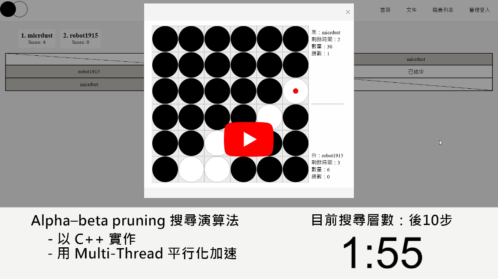

# 黑白棋

## 使用技術概要

- 使用 Alpha-Beta Minmax 搜尋。
- 使用穩定子分數、可行步分數等數據加權作為評估函數。
- 依照靜態的位置權重排序搜尋順序，以加速找到最佳動作。
- 使用 C++ 實作 Alpha-Beta 並編譯成 Dynamic-link library 給 Python 調用。
- 使用平行化與位元運算加速。
- 統計不同搜尋深度下的表現情形並調整評估函數。

## 使用方式

1. 使用 alpha_beta_c 裡的 make 編譯
2. 去 config.cfg 設定 (dll 可以選 lib 裡有的)
3. 使用 alpha_beta_c_6x6_config.py 中的 get_action 就能計算盤面 board 的下一步

## 各種版本

| C++程式 | 說明 |
|  ----  |  ----  |
| alpha_beta_bit_6x6_ratio.cpp | Minify bit version with RATIO in evaluation. |
| alpha_beta_bit_6x6_min.cpp | Minify bit version without RATIO in evaluation |
| alpha_beta_bit_6x6_true_stable.cpp | Bit version with true stable evaluation |
| alpha_beta_bit_6x6.cpp | Bit version with unit test function |
| alpha_beta_bit_6x6.cpp | Bit version for 8x8 |
| alpha_beta_mt_true_stable_6x6.cpp | Multi-thread version with true stable evaluation |
| alpha_beta_multi_thread_6x6.cpp | Multi-thread version |
| alpha_beta_single_6x6.cpp | Single-thread version |
| alpha_beta.cpp | Single-thread version for 8x8 |
| scout_mt_bit_6x6.cpp | Bit version with scout algorithm |
| scout_multi_thread.cpp | Multi-thread version with scout algorithm |

